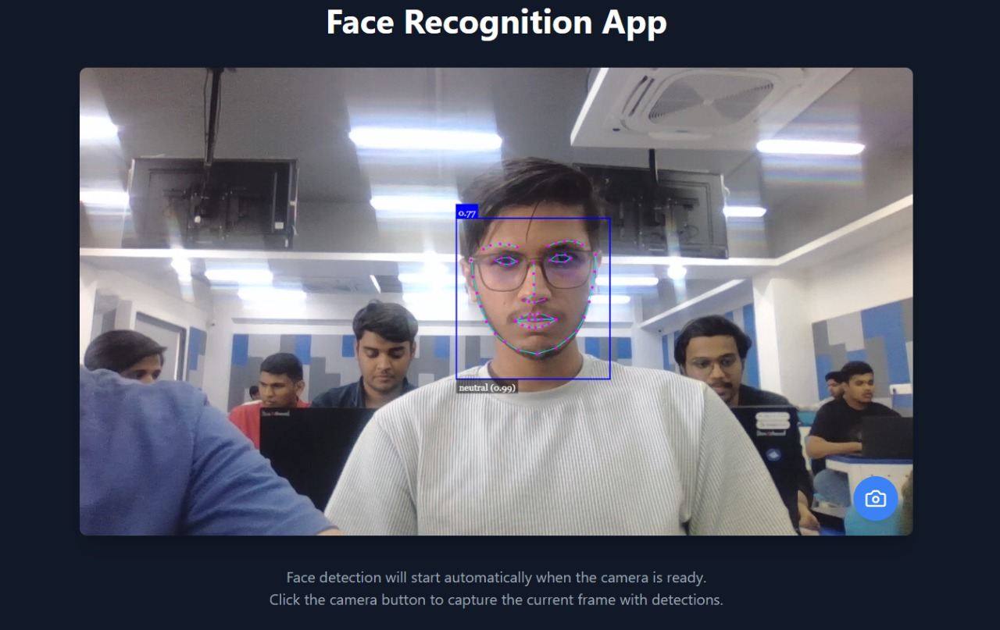

# 🚀 Smart Inventory Theft Detection System

## 📌 Problem Statement  
Traditional inventory management lacks **real-time security**, leading to unauthorized access and theft. This system integrates **AI, IoT, and data analytics** to detect and prevent theft in inventory management.

## 🔍 Solution Overview  
Our system uses **AI-powered face recognition, real-time monitoring, and role-based security** to prevent unauthorized access and theft.  

### ✅ Key Features  
- **Face Recognition Access Control** – Detects faces in real-time, allowing known users while flagging unknown ones.  
- **Automated Alerts & Monitoring** – Live feeds, logs access attempts, and alerts admins on unauthorized entries.  
- **Role-Based Security** – Controls access based on user roles (Admin, Employee, Visitor).  
- **Secure & Scalable** – Uses encryption, cloud compatibility, and supports IoT integration.  

---

## 🛠️ Tech Stack  
- **Frontend:** React.js (Vite)  
- **Backend:** Node.js 

---

## 🖼️ Interface Screenshots  

### **3️⃣ Face Recognition Access**  
 

### **4️⃣ Alerts & Monitoring**  
  

### **1️⃣ Login Page**  
  

### **2️⃣ Dashboard**  
  


---

## 🔧 Setup Instructions  
### **1️⃣ Clone the Repository**  
```sh
git clone https://github.com/raviraj2-c/smart-inventory-theft-detection.git 
cd smart-inventory-theft-detection
